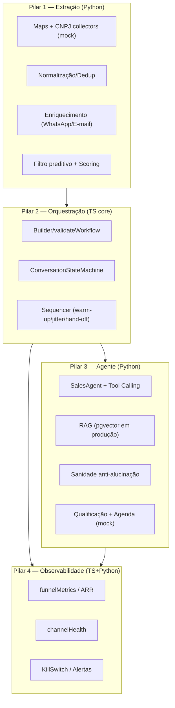

# Growth OS — Arquitetura

## Visão
Sistema distribuído, orientado a eventos, de prospecção ativa com **intervenção humana zero até a reunião qualificada**, operando em **modo design/simulação** (fail-closed).



## Decisões técnicas
- **Stack:** NestJS (API) + Temporal/BullMQ (longa duração) · Python (workers) · PostgreSQL + pgvector · React.
- **Domínio em TS puro** (`@growthos/core`) — testável sem infra; NestJS/Temporal são adapters finos.
- **Mocks isolados:** coletores, canais e agenda são providers mock; provedores reais trocam pelo mesmo contrato.
- **Fail-closed:** config valida limites; compliance bloqueia opt-out/volume; kill-switch pausa campanhas.

## Repositório
```
packages/core/          domínio TS (config, pilar2, pilar4, s9)
workers/python/         workers: pilar1, pilar3, pilar4, simulation
migrations/             SQL (pgvector)
scripts/load-test.mjs   teste de carga simulado
apps/                   API (NestJS) e web (React) — próximas fases
```

## Roadmap de evolução
1. **Fase 2:** API NestJS + Temporal worker conectados ao core (em nova sprint autorizada).
2. **Fase 3:** provedores reais (WhatsApp Business, e-mail verificado, Cal.com) — **somente** com `GROWTHOS_MODE=approved`.
3. **Fase 4:** dashboard React com builder drag-and-drop.
