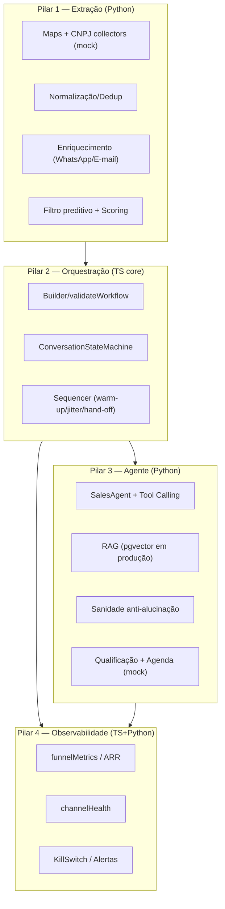

# Growth OS — Arquitetura

## Visão
Sistema distribuído, orientado a eventos, de prospecção ativa com **intervenção humana zero até a reunião qualificada**, operando em **modo design/simulação** (fail-closed).



## Decisões técnicas
- **Stack:** NestJS (API) + Temporal/BullMQ (longa duração) · Python (workers) · PostgreSQL + pgvector · React.
- **Domínio em TS puro** (`@growthos/core`) — testável sem infra; NestJS/Temporal são adapters finos.
- **Mocks isolados:** coletores, canais e agenda são providers mock; provedores reais trocam pelo mesmo contrato.
- **Fail-closed:** config valida limites; compliance bloqueia opt-out/volume; kill-switch pausa campanhas.

## Contrato do pacote `@growthos/core`
- **Formato: CommonJS** (desde a Fase 2; `package.json` sem `type: module`).
- **Mudança de contrato público registrada:** a conversão de ESM → CJS não apresentou regressão; consumidores validados:
  - **NestJS** (`apps/api`, CJS) — `require`/`@growthos/core`;
  - **Temporal** (`apps/temporal-worker`, CJS) — bundling do workflow via `require.resolve`;
  - **Vite/ESM** (`apps/web` não consome core; `vitest` e `scripts/load-test.mjs` consomem via ESM interop).
- `exports` resolve `@growthos/core` → `./dist/index.js` e `@growthos/core/<subpath>` → `./dist/<subpath>.js`.
- Consumidores externos que exijam ESM puro (ex.: top-level await) **não são suportados** — documentado como limite do contrato.

## Repositório
```
packages/core/          domínio TS (config, pilar2, pilar4, s9, erros, logger) — CommonJS
workers/python/         workers: pilar1, pilar3, pilar4, simulation, pipeline/repo (psycopg)
apps/api/               API NestJS (campaigns, health, metrics, suppression, events, leads, status) + persistência PostgreSQL (pg)
apps/temporal-worker/   worker Temporal + workflow campaignRun (activities: api + send mock)
apps/web/               dashboard React/Vite (Dashboard, Builder, Leads & Suppression)
migrations/             SQL 001–008 (pgvector) — runner: npm run migrate --workspace=@growthos/api
scripts/load-test.mjs   teste de carga simulado
.github/workflows/ci.yml  CI: ts-core · ts-apps · web · python-workers
```

## Persistência (Fase 3 — completa)
- Postgres do Docker publicado em **`localhost:5433`** (evita conflito com Postgres local do Windows na 5432).
- `DbModule` (pool `pg`) + `PersistenceModule` (global) com stores: **KillSwitchStore, SuppressionStore, CampaignStore, CounterStore, EventStore, LeadStore** (impls `pg` + em memória para testes).
- **Migrations 001–008:** leads_raw, leads_enriched, kill_switch_state, suppression, campaigns, funnel_counters, events, pipeline_runs.
- **Eventos idempotentes** (`POST /events`, chave `eventId` com `ON CONFLICT DO NOTHING`); opt-out (`optout`) alimenta suppression automaticamente.
- **Pipeline persistente Python** (`LeadRepository` psycopg): `save_run` + `upsert_leads` (ON CONFLICT atualiza `pipeline_run_id`/`processed_at`) → rastreabilidade por run.
- Testes e2e herméticos (stores em memória via override); integração real cobre persistência/restart (prova de restart real).
- Sem provedores externos reais: permanece **modo design/simulação** (`GROWTHOS_MODE=simulation`); provedores reais exigem `GROWTHOS_MODE=approved` + credenciais.

## Execução Temporal (Fase 3, Bloco C)
- Workflow `campaignRun` (queue `growthos-campaign`): `validateWorkflow` (erros estruturados) → `getKillSwitch` (paused → return) → por lead: `isSuppressed` (skip) → `sendMessage` → `recordEvent` (sent/delivered/read/replied).
- Activities via HTTP à API (kill-switch/suppression/eventos) + send mock (reply implica read).
- Retries: `initialInterval 1s · backoff 2 · maxAttempts 5`; idempotência por `eventId wf-{campaignId}-{leadId}-{type}`.
- Prova real: 7 dispatched (lead-0 suppressido pulado), métricas 7/7/4/1, replyRate 25%, health 70.5.

## Segurança (Fase 3, Bloco E)
- `ApiKeyGuard` config-driven via `GROWTHOS_API_KEY` (header `X-Api-Key`; 401 sem/errado, 200 com a chave) + `AllExceptionsFilter` (erros estruturados) + validação de entrada (zod no core + DTOs).
- Sanitização de texto via `s9/security` no core; sem credenciais reais no repositório (apenas `.env.example`).

## Roadmap de evolução
1. **Fase 1 (S0–S9):** domínio TS + workers Python + infra (GATE aprovado). ✅
2. **Fase 2:** API NestJS + worker Temporal (workflow real) + dashboard React. ✅
3. **Fase 3 (Blocos 1 + A–F):** persistência durável, eventos idempotentes, pipeline persistente, execução Temporal com suppression/kill-switch/retries, dashboard ampliado, API key/erros estruturados, conformidade TS/Python + CI. ✅
4. **Provedores reais** (WhatsApp Business, e-mail verificado, Cal.com, Maps/CNPJ reais) — **somente** com `GROWTHOS_MODE=approved` e credenciais reais (atualmente **BLOCKED_EXTERNAL**).
5. **Fase 4:** builder drag-and-drop completo + multi-tenant.
