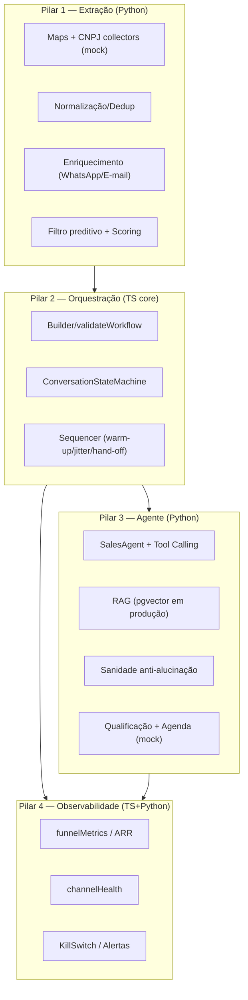

# Growth OS — Arquitetura

## Visão
Sistema distribuído, orientado a eventos, de prospecção ativa com **intervenção humana zero até a reunião qualificada**, operando em **modo design/simulação** (fail-closed).



## Decisões técnicas
- **Stack:** NestJS (API) + Temporal/BullMQ (longa duração) · Python (workers) · PostgreSQL + pgvector · React.
- **Domínio em TS puro** (`@growthos/core`) — testável sem infra; NestJS/Temporal são adapters finos.
- **Mocks isolados:** coletores, canais e agenda são providers mock; provedores reais trocam pelo mesmo contrato.
- **Fail-closed:** config valida limites; compliance bloqueia opt-out/volume; kill-switch pausa campanhas.

## Contrato do pacote `@growthos/core`
- **Formato: CommonJS** (desde a Fase 2; `package.json` sem `type: module`).
- **Mudança de contrato público registrada:** a conversão de ESM → CJS não apresentou regressão; consumidores validados:
  - **NestJS** (`apps/api`, CJS) — `require`/`@growthos/core`;
  - **Temporal** (`apps/temporal-worker`, CJS) — bundling do workflow via `require.resolve`;
  - **Vite/ESM** (`apps/web` não consome core; `vitest` e `scripts/load-test.mjs` consomem via ESM interop).
- `exports` resolve `@growthos/core` → `./dist/index.js` e `@growthos/core/<subpath>` → `./dist/<subpath>.js`.
- Consumidores externos que exijam ESM puro (ex.: top-level await) **não são suportados** — documentado como limite do contrato.

## Repositório
```
packages/core/          domínio TS (config, pilar2, pilar4, s9) — CommonJS
workers/python/         workers: pilar1, pilar3, pilar4, simulation
apps/api/               API NestJS (campaigns, health, metrics, suppression) + persistência PostgreSQL (pg)
apps/temporal-worker/   worker Temporal + workflow campaignRun (atividades mock)
apps/web/               dashboard React (builder + métricas + saúde)
migrations/             SQL (pgvector) — runner: npm run migrate --workspace=@growthos/api
scripts/load-test.mjs   teste de carga simulado
```

## Persistência (Fase 3, Bloco 1)
- Postgres do Docker publicado em **`localhost:5433`** (evita conflito com Postgres local do Windows na 5432).
- `DbModule` (pool `pg`) + `PersistenceModule` (stores: kill_switch_state, suppression, campaigns, funnel_counters).
- Testes e2e são herméticos (stores em memória via override); integração real cobre persistência/restart.
- Sem provedores externos reais: permanece **modo design/simulação** (`GROWTHOS_MODE=simulation`).

## Roadmap de evolução
1. **Fase 2 (entregue):** API NestJS + worker Temporal (workflow executado no Temporal local) + dashboard React — integrados sobre o core validado.
2. **Fase 3 (em andamento):** Bloco 1 — persistência durável (kill-switch/suppression/campanhas/contadores) entregue; próximos blocos: ingestão de eventos do funil, idempotência, ARR em config, contrato TS/Python.
3. **Provedores reais** (WhatsApp Business, e-mail verificado, Cal.com) — **somente** com `GROWTHOS_MODE=approved`.
4. **Fase 4:** builder drag-and-drop completo + multi-tenant.
