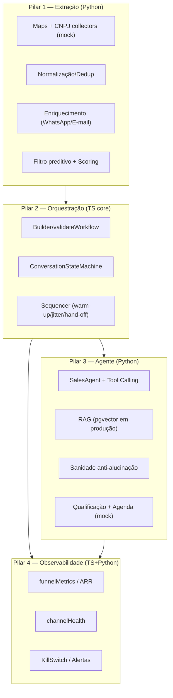

# Growth OS — Arquitetura

## Visão
Sistema distribuído, orientado a eventos, de prospecção ativa com **intervenção humana zero até a reunião qualificada**, operando em **modo design/simulação** (fail-closed).



## Decisões técnicas
- **Stack:** NestJS (API) + Temporal/BullMQ (longa duração) · Python (workers) · PostgreSQL + pgvector · React.
- **Domínio em TS puro** (`@growthos/core`) — testável sem infra; NestJS/Temporal são adapters finos.
- **Mocks isolados:** coletores, canais e agenda são providers mock; provedores reais trocam pelo mesmo contrato.
- **Fail-closed:** config valida limites; compliance bloqueia opt-out/volume; kill-switch pausa campanhas.

## Contrato do pacote `@growthos/core`
- **Formato: CommonJS** (desde a Fase 2; `package.json` sem `type: module`).
- **Mudança de contrato público registrada:** a conversão de ESM → CJS não apresentou regressão; consumidores validados:
  - **NestJS** (`apps/api`, CJS) — `require`/`@growthos/core`;
  - **Temporal** (`apps/temporal-worker`, CJS) — bundling do workflow via `require.resolve`;
  - **Vite/ESM** (`apps/web` não consome core; `vitest` e `scripts/load-test.mjs` consomem via ESM interop).
- `exports` resolve `@growthos/core` → `./dist/index.js` e `@growthos/core/<subpath>` → `./dist/<subpath>.js`.
- Consumidores externos que exijam ESM puro (ex.: top-level await) **não são suportados** — documentado como limite do contrato.

## Repositório
```
packages/core/          domínio TS (config, pilar2 [incl. campaign-run], pilar4 [incl. invariantes], s9 [incl. CNPJ], erros, logger) — CommonJS
workers/python/         workers: pilar1, pilar3, pilar4, simulation, pipeline/repo (psycopg)
apps/api/               API NestJS (campaigns [launcher Temporal], health, metrics, suppression, events, leads, status) + persistência PostgreSQL (pg) + ZodValidationPipe
apps/temporal-worker/   worker Temporal + workflow campaignRun (delega ao executor puro do core)
apps/web/               dashboard React/Vite (Dashboard, Builder, Leads & Suppression) + cliente com X-Api-Key
migrations/             SQL 001–009 (pgvector) — runner com lock/transação: npm run migrate --workspace=@growthos/api
scripts/load-test.mjs   teste de carga simulado · scripts/health-reference.mjs  referência TS p/ conformidade cruzada
.github/workflows/ci.yml  CI: ts-core · ts-apps (postgres) · web · python-workers (postgres + referência TS)
```

## Persistência (Fase 3 — completa)
- Postgres do Docker publicado em **`localhost:5433`** (evita conflito com Postgres local do Windows na 5432).
- `DbModule` (pool `pg`) + `PersistenceModule` (global) com stores: **KillSwitchStore, SuppressionStore, CampaignStore, CounterStore, EventStore, LeadStore** (impls `pg` + em memória para testes).
- **Migrations 001–009:** leads_raw (PLANEJADO — staging crua; pipeline atual grava em leads_enriched), leads_enriched, kill_switch_state, suppression, campaigns, funnel_counters, events, pipeline_runs, FKs (leads_enriched→pipeline_runs + CHECK não-negativo dos contadores).
- **Eventos ATÔMICOS e idempotentes** (`POST /events`, chave `eventId`): `PgEventStore` grava evento + efeito (contador/optout) na **mesma transação** (H1) — nunca existe “evento persistido + contador ausente”.
- **Invariantes do funil (H2):** `assertFunnelInvariant` (core) rejeita eventos fora de ordem (`delivered≤sent`, `read≤delivered`, `replied≤read`, …) com **422** — taxas nunca >100% por construção.
- **Pipeline persistente Python** (`LeadRepository` psycopg): `save_run` (primeiro) + `upsert_leads` (ON CONFLICT atualiza `pipeline_run_id`/`processed_at`) → rastreabilidade por run com FK.
- Testes e2e herméticos (stores em memória via override); integração real cobre persistência/restart + atomicidade/concorrência de eventos (prova real).
- Sem provedores externos reais: permanece **modo design/simulação** (`GROWTHOS_MODE=simulation`); provedores reais exigem `GROWTHOS_MODE=approved` + credenciais.

## Execução Temporal + API→Temporal (C1)
- **Launcher:** `POST /campaigns/:id/start` (status `active`) → `WorkflowLauncher` (produção: `TemporalWorkflowLauncher` com `@temporalio/client`; testes: fake determinístico). workflowId estável por campanha (`growthos-{id}`) — início duplicado → 409.
- **Workflow `campaignRun`** (queue `growthos-campaign`) delega ao **executor puro** `executeCampaignRun` (core): valida workflow → kill-switch no início E **entre cada lead** (H5 — interrompe novos envios; ponto seguro) → suppression por lead → send mock → eventos em ordem canônica (idempotentes por `eventId wf-{id}-{lead}-{type}`).
- Activities via HTTP à API; retries `1s · ×2 · 5`; send mock: replied implica read.
- **Prova real (C1):** campanha `49b0f2d8` via produto — l0 (supprimido) 0 eventos, l1 `sent+delivered`, l2 `sent+delivered+read`.
- **Prova real (H5):** 300 leads, pause após 2s → `dispatched:2, paused:true`; resume manual + re-run → `dispatched:300` idempotente.

## Segurança (GAUNTLET V2)
- **Contrato de modos (C2):** `approved` exige `GROWTHOS_API_KEY` no boot (`assertSafeBoot`) e no guard em todas as rotas — fail-closed. `simulation`/`design` permitem dev local sem chave.
- `ApiKeyGuard` + `ThrottlerGuard` (rate limit env `GROWTHOS_RATE_LIMIT_*`, 429) + `AllExceptionsFilter` (erros estruturados; mapeia `FUNNEL_INVARIANT`→422 e payload→413) + `ZodValidationPipe` (validação estruturada H4) + `ParseUUIDPipe` (404 H3).
- CORS por ambiente (`GROWTHOS_CORS_ORIGINS`; approved sem allowlist bloqueia) · payload limit (`GROWTHOS_BODY_LIMIT`).
- Sanitização de texto via `s9/security` no core; sem credenciais reais no repositório (apenas `.env.example`).

## Autenticação humana (S2) + auditoria de segurança (S10)
- **Dois domínios distintos (nunca misturar):**
  - **Operador humano**: `operators` (id, email único, `password_hash` **argon2id**, role, active) + **sessão servidor-side** (`sessions`: `token_hash`=sha256, `csrf_token`, expiração, revogação) em cookie `HttpOnly`/`SameSite=Lax`/`Secure` (approved). Endpoints `POST /auth/login`, `GET /auth/me`, `POST /auth/logout`.
  - **Máquina-a-máquina**: `X-Api-Key` (ApiKeyGuard). O **navegador nunca** recebe a chave administrativa (`VITE_API_KEY` removido; prova automatizada no bundle).
- **Primeiro operador** via CLI local (`npm run admin:create --workspace=@growthos/api <email>`), nunca por endpoint HTTP público.
- **CSRF**: token por sessão (servidor-side) devolvido em login/me e exigido em mutações autenticadas por sessão (403 se ausente/errado; testado).
- **Matriz de rotas** (decorators `@Public`/`@Human`/`@Shared`/`@M2M`; padrão `human` = fail-closed):
  - `public`: `POST /auth/login`, `GET /auth/me`, `GET /channels/health`.
  - `human` (sessão): `/status`, `/metrics/funnel`, `/campaigns*`, `/suppression` (list/add), `/leads*`, `/channels/pause|resume`, `/security/audit`.
  - `shared` (sessão OU chave): `POST /events`, `GET /channels/kill-switch`, `GET /suppression/:cnpj`.
- **Sessão persistente** em Postgres (sobrevive a restart — provado; contrato de expiração `GROWTHOS_SESSION_TTL_MS`, revogação por logout/desativação).
- **S10 — auditoria de segurança**: `SecurityAuditService` emite eventos estruturados (`AUTH_LOGIN_SUCCESS/FAILURE`, `AUTH_LOGOUT`, `AUTH_SESSION_INVALID`, `AUTHORIZATION_DENIED`, `RATE_LIMIT_HIT`) com metadados seguros (request_id, ip, path, user_agent, actor), persistidos em `security_audit_events` (append-only, servidor) e consultáveis por `GET /security/audit` (humano). **Redação garantida por construção** (nunca senha/API key/session/CSRF/connection string) — testado. Sink externo previsto via `SecurityAuditSink` (adapter no-op).
  - `SECURITY EVENT DETECTION: IMPLEMENTED` · `EXTERNAL ALERT DELIVERY: BLOCKED_EXTERNAL`.

## Roadmap de evolução
1. **Fase 1 (S0–S9):** domínio TS + workers Python + infra (GATE aprovado). ✅
2. **Fase 2:** API NestJS + worker Temporal (workflow real) + dashboard React. ✅
3. **Fase 3 (Blocos 1 + A–F):** persistência durável, eventos idempotentes, pipeline persistente, execução Temporal, dashboard, segurança, conformidade + CI. ✅
4. **GAUNTLET V2 (hardening):** C1 (API→Temporal), C2 (modos fail-closed), H1 (eventos atômicos), H2 (invariantes), H3 (404), H4 (validação), H5 (kill-switch em execução + resume), H6 (rate/payload/CORS), H7 (dashboard com key), médios (FK, migrations lock, conformidade cruzada, CI com Postgres). ✅
5. **Provedores reais** (WhatsApp Business, e-mail verificado, Cal.com, Maps/CNPJ reais) — **somente** com `GROWTHOS_MODE=approved` e credenciais reais (atualmente **BLOCKED_EXTERNAL**).
6. **Fase 4:** builder drag-and-drop completo + multi-tenant.
